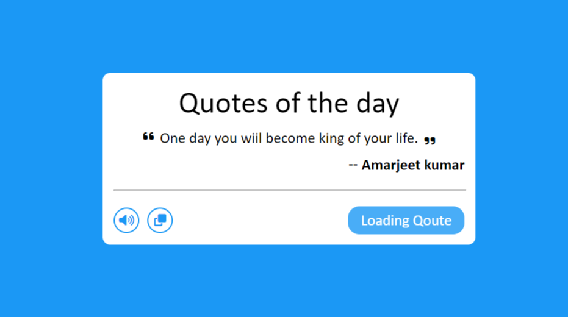

# EMI Calculator App
 ### I have created a Random Quote Generator of HTML,CSS and JavaScript.

## Technology Used:-
  - ` HTML ` 
  - ` CSS ` 
  - ` JS ` 

### Also The Web page has a theme Changer , So you can see the content in light mode as well as daek mode.

 

 
 

Live Link:- [Click here!](https://amarjeet-random-quotes-generator.netlify.app/)

Picture of my project:-

## What I learned from this project?
 - How I can use any API in my project.
 - Code for Copy the text.
  

